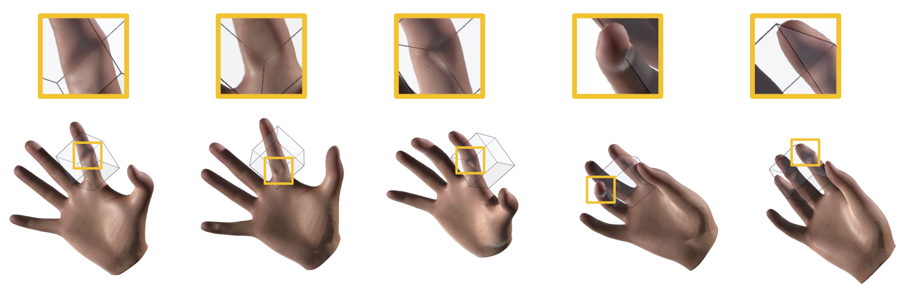

# Contact-Centric Deformation Learning



[[Project website](http://mslab.es/projects/ContactCentricLearning/)] [[Video](https://www.youtube.com/watch?v=f2WBji-R2uQ)] [[Data](https://urjc-my.sharepoint.com/:f:/g/personal/cristian_romero_urjc_es/ElOMJ-NU8N9GtnCTVaPCG8sBRivhuxRoPv45qCSz8zbH2w?e=feu4Yr)]

## Abstract

> We propose a novel method to machine-learn highly detailed, nonlinear contact deformations for real-time dynamic simulation. We depart from previous deformation-learning strategies, and model contact deformations in a contact-centric manner. This strategy shows excellent generalization with respect to the object's configuration space, and it allows for simple and accurate learning. We complement the contact-centric learning strategy with two additional key ingredients: learning a continuous vector field of contact deformations, instead of a discrete approximation; and sparsifying the mapping between the contact configuration and contact deformations. These two ingredients further contribute to the accuracy, efficiency, and generalization of the method. We integrate our learning-based contact deformation model with subspace dynamics, showing real-time dynamic simulations with fine contact deformation detail.

**Requirements**: ```python3```, ```h5py``` ```numpy```

# Meshes

[meshes.h5](https://urjc-my.sharepoint.com/:u:/g/personal/cristian_romero_urjc_es/Ebt-feS-y11IrI2eNiJDJKsB8p2X2nvQrsBskRKqMNOXtw?e=ZXljTs)

| Key          | Key      | Description                        | Dimension                           |
|--------------|----------|------------------------------------|-------------------------------------|
|  *jelly*     | *W*      | Linear basis (BGBC)                | [num_jelly_nodes, num_handle_rows]  |
|              | *q_ref*  | Reference transformations          | [num_handle_rows, dim]              |
|              | *tris*   | Triangle indices                   | [num_jelly_tris, dim]               |
|              | *tets*   | Tetrahedron indices                | [num_jelly_tets, dim+1]             |
|  *star*      | *W*      | Linear basis (rigid)               | [num_star_nodes, dim+1]             |
|              | *z_ref*  | Reference transformation           | [dim+1, dim]                        |
|              | *tris*   | Triangle indices                   | [num_star_tris, dim]                |

# Dataset

[dataset.h5](https://urjc-my.sharepoint.com/:u:/g/personal/cristian_romero_urjc_es/EbtlJKEUh81ArGxfYOSuc6EBOi9ZWF09Nve8B-0uUG2bsA?e=GgQD2x)

| Key    | Description                   | Dimension                            |
|--------|-------------------------------|--------------------------------------|
| *q*    | Handle transformations        | [num_samples, num_handle_rows, dim]  |
| *z*    | Collider transformation       | [num_samples, dim+1, dim]            |
| *x*    | Simulated node positions      | [num_samples, num_jelly_nodes, dim]  |
